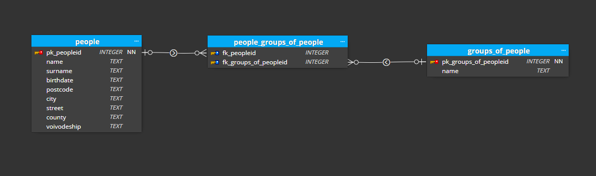
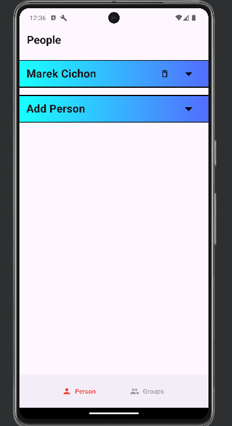
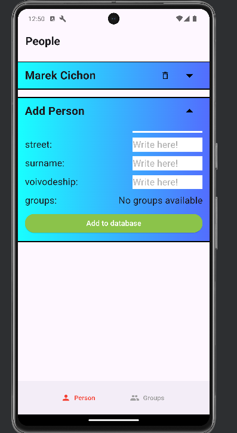
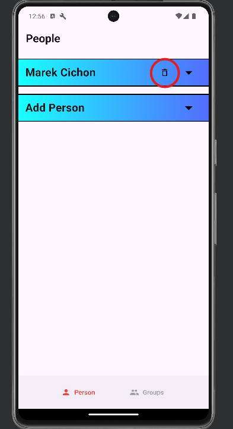
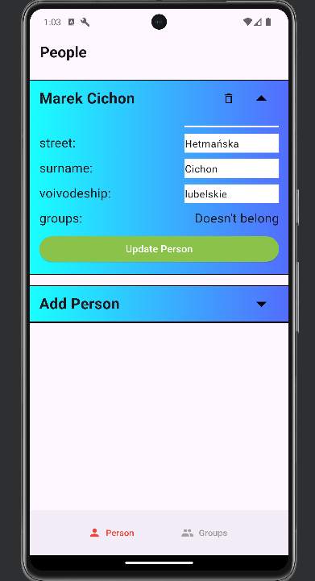
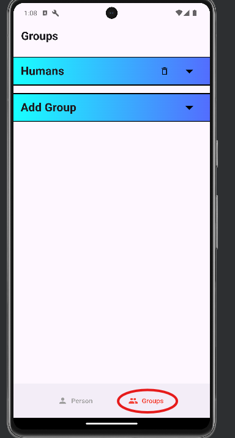
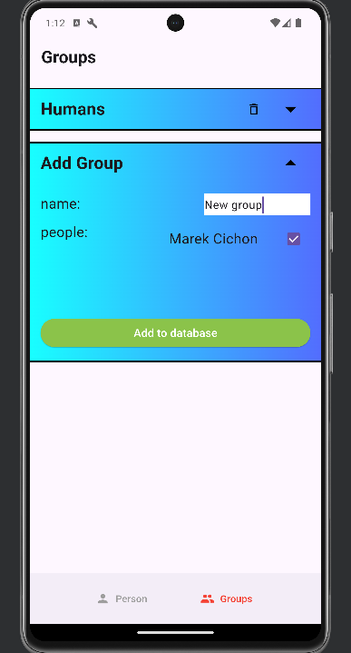
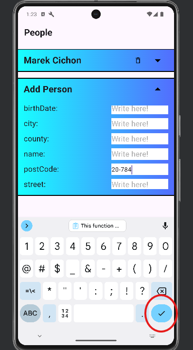

# People Management

Welcome to the **People Management** project. This is a mobile application designed for managing individuals and the groups they belong to. 
**The program has only been tested on an Android device, so please test it only on this platform.** 
The program should also work on the iOS system, but this has not been tested.

## Table of Contents
- [Database](#database)
- [Features](#features)
- [Installation](#installation)
- [Packages](#packages)
- [Possible improvements](#possible-improvements)

## Database
ERD of database:



## Features

### Displaying a list of people

When you launch the program, a list of all people will be displayed. 
Of course, initially, it will be empty, but after adding a person, the view will refresh, and the person will be visible in the list.
The example is shown in the image below. 



### Adding a person
You can add a person by expanding the "Add Person" tab and pressing "Add to database" button. After expanding the tab, the user must fill in all fields. 
**If any field is left empty(expect for groups that can be left empty), the operation will not be completed.** The same person can be added multiple times. 
No field (except for the ID) is unique.



### Deleting a person
It is also possible to delete a person by clicking on the trash icon located on the bar with the person's data. 
After pressing the button, the person will be removed from the database, the view will refresh, and the list will be displayed without the deleted person.



### Editing a person
You can also edit a person by expanding their entry and editing their data. Similar to adding a person, 
**all fields must be filled out for the operation to be completed.**



### Displaying a list of groups of people
After clicking on the "Groups" tab, located in the bottom navigation, all the groups in the database will be displayed.



### Adding a group of people
Similar to the process of adding a person, all fields must be filled out to add a group.



### Deleting a group of people
Similarly you can delete group by pressing trash icon.

### Editing a group of people
Editing for groups works in the same manner as editing for person.

### Completing data using a postal code

#### Important
This function only works when adding a person and does not work for updating a person. 
After entering a postal code (whether correct or not) and confirming by pressing the Submit button on the keyboard,
the program will attempt to retrieve all possible data from the API. The program will then fill in fields with data from API.



## Installation

1. You have to install IDE. This project was created using Android Studio IDE and I highly recommend it. Go to the website [here](https://developer.android.com/studio) and follow their steps to install it.
2. After you install your IDE of choice you have to install Flutter framework. Go to the website [here](https://docs.flutter.dev/get-started/install) and follow their steps to install it.
3. Clone the repository:
    ```sh
    git clone https://github.com/Borokoro/people_management.git
    ```
4. Open the project
5. Use the commands in your project file:
    ```
    flutter upgrade
    flutter pub get
    ```
6. Install emulator or connect your phone to your computer using USB cable with  USB Debugging turned on
7. Run application. I highly recommend to run application in release mode, for the best effect, using the command below:
    ```
    flutter run --release
    ```
   
## Packages

- [sqflite](https://pub.dev/packages/sqflite)
- [intl](https://pub.dev/packages/intl)
- [flutter_bloc](https://pub.dev/packages/flutter_bloc)
- [get_it](https://pub.dev/packages/get_it)
- [bloc](https://pub.dev/packages/bloc)
- [path_provider](https://pub.dev/packages/path_provider)
- [equatable](https://pub.dev/packages/equatable)
- [dartz](https://pub.dev/packages/dartz)
- [dio](https://pub.dev/packages/dio)
- [requests_inspector](https://pub.dev/packages/requests_inspector)

## Possible improvements

- Adding regular expressions to validate the entered data
- Adding popups to indicate the success or failure of an operation
- Adding button that will allow user to modify data. Right now all the data are displayed in an editable TextFormField so user can accidentally modify the data.
